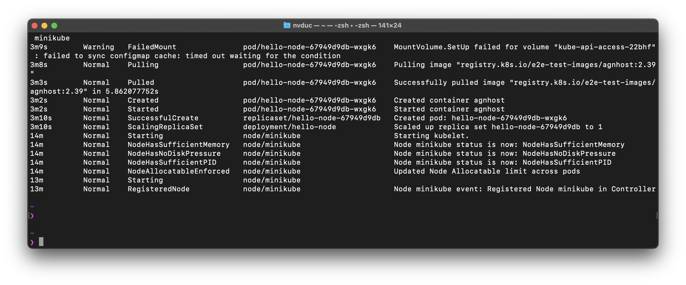

- A Kubernetes [*Pod*](https://kubernetes.io/docs/concepts/workloads/pods/) is a group of one or more Containers, tied together for the purposes of administration and networking
	- View all pods
	-
- A Kubernetes [*Deployment*](https://kubernetes.io/docs/concepts/workloads/controllers/deployment/) checks on the health of your Pod and restarts the Pod's Container if it terminates
	- What is a deployment really is ? Is it a Service ? Or is it an application ?
	- Is it a scheduler ? Or a monitor ?
	- Create a deployment by this command
		- ```shell
		  kubectl create deployment hello-node --image=registry.k8s.io/e2e-test-images/agnhost:2.39 -- /agnhost netexec --http-port=8080
		  ```
	- View all deployments
		- ```shell
		  kubectl get deployments
		  ```
- View all events from Kubernetes
	- ```shell
	  kubectl get events
	  ```
	- The output shows a list of events happens in Kubernetes, starting from starting Kubernetes service from the last line
		- 
- View cluster configuration in `yaml` format
	- ```shell
	  kubectl config view
	  ```
- Expose Kubernetes Pod from its cluster by creating a [[Kubernetes Service]]
-